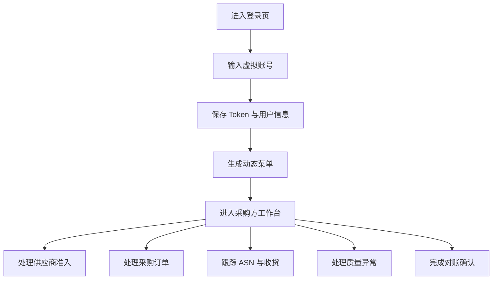

## 1. 产品概述
供应商协同系统前端第一、二阶段用于搭建采购方后台的基础框架与核心业务模块原型，支撑内部用户完成供应商、订单、ASN、质量、对账等主流程操作。
- 目标用户包括采购员、质量工程师、仓储人员、财务人员与系统管理员。
- 当前阶段全部业务数据使用前端虚拟数据，优先验证页面结构、交互流程、权限菜单与业务信息组织方式。

## 2. 核心功能

### 2.1 用户角色
| 角色 | 登录方式 | 核心权限 |
|---|---|---|
| 系统管理员 | 账号密码登录 | 查看全部菜单、系统配置、用户权限管理入口 |
| 采购员 | 账号密码登录 | 供应商管理、订单协同、ASN 跟踪 |
| 质量工程师 | 账号密码登录 | 检验任务、NCR、8D 整改、质量申诉 |
| 仓储人员 | 账号密码登录 | ASN、收货、差异处理 |
| 财务人员 | 账号密码登录 | 对账单、发票、付款进度 |

### 2.2 功能模块
1. **登录与鉴权**：登录页、Token 存储、用户信息、权限码、路由守卫。
2. **采购方后台框架**：侧边菜单、顶部栏、面包屑、工作台、动态菜单。
3. **供应商管理**：供应商列表、详情、准入审核、资质管理、绩效看板。
4. **采购订单协同**：订单列表、订单详情、接单确认、订单变更、订单轨迹。
5. **物流与交付**：ASN 列表、ASN 创建、标签打印、收货、差异处理。
6. **质量协同**：检验任务、检验记录、NCR、8D 整改、质量申诉。
7. **财务结算**：对账单、对账详情、对账确认、发票管理、付款进度。

### 2.3 页面详情
| 页面名称 | 模块名称 | 功能描述 |
|---|---|---|
| 登录页 | 身份认证 | 输入账号密码，使用虚拟账号登录并进入采购方后台 |
| 工作台 | 首页总览 | 展示待办、风险预警、订单趋势、核心指标 |
| 供应商列表 | 供应商管理 | 查询、状态筛选、分页、查看详情、准入审核入口 |
| 供应商详情 | 供应商管理 | 基础信息、资质、绩效、操作日志、审核动作 |
| 订单列表 | 采购订单协同 | 查询订单、状态流转、确认接单、查看轨迹 |
| 订单详情 | 采购订单协同 | 单据头、明细、变更记录、轨迹、操作日志 |
| ASN 列表 | 物流与交付 | 查询发货通知、创建 ASN、打印标签、收货入口 |
| ASN 详情 | 物流与交付 | 发货明细、物流信息、收货差异、处理记录 |
| 质量列表 | 质量协同 | 检验任务、NCR、8D、申诉的统一入口 |
| 质量详情 | 质量协同 | 检验结果、整改进度、责任方、附件占位 |
| 对账列表 | 财务结算 | 查询对账单、确认对账、发票与付款状态 |
| 对账详情 | 财务结算 | 对账明细、差异项、发票、付款进度、确认动作 |
| 403/404 | 异常页面 | 展示无权限与页面不存在提示 |

## 3. 核心流程
用户通过登录页进入系统后，前端保存 Token 与用户上下文，路由守卫拉取虚拟权限并生成采购方后台菜单。内部用户在工作台查看待办与风险，再进入供应商、订单、ASN、质量、对账模块完成查询、详情查看与状态动作。

## 4. 用户界面设计

### 4.1 设计风格
- 主色使用工业蓝与深海蓝，辅助色使用青绿、琥珀、赤红表达成功、预警与异常。
- 布局采用企业级后台的左侧导航 + 顶部工具栏 + 内容卡片结构。
- 页面风格强调专业、克制、信息密度高，适合采购协同、供应链风控与单据处理。
- 按钮、状态标签、指标卡、表格操作列保持统一层级，突出待处理事项。
- 图标使用 Element Plus 图标，减少额外资源依赖。

### 4.2 页面设计概览
| 页面名称 | 模块名称 | UI 元素 |
|---|---|---|
| 登录页 | 身份认证 | 品牌区、账号表单、虚拟账号提示、渐变背景 |
| 工作台 | 首页总览 | 指标卡、待办列表、风险卡片、趋势占位图 |
| 列表页 | 通用业务列表 | 查询表单、表格、分页、状态标签、操作按钮 |
| 详情页 | 单据详情 | 单据头、基础信息、明细表、日志时间线、动作区 |
| 异常页 | 错误反馈 | 状态码、说明文案、返回首页按钮 |

### 4.3 响应式
采用桌面优先设计，优先适配 1366px 以上办公场景；小屏下收起侧边栏，表格横向滚动，关键操作保留在顶部动作区。
