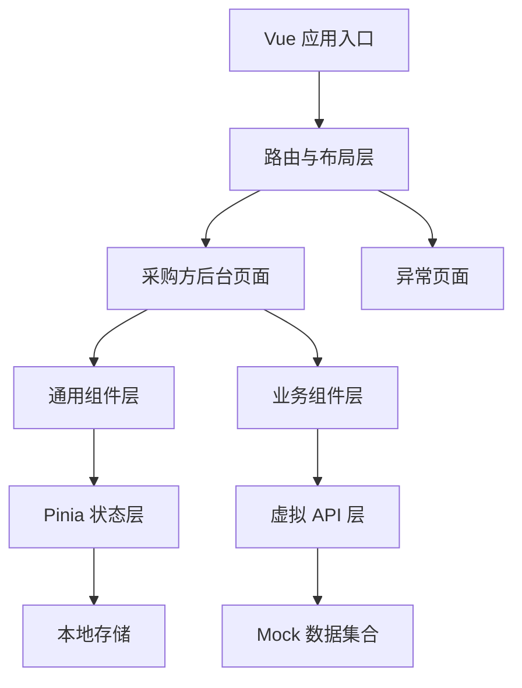
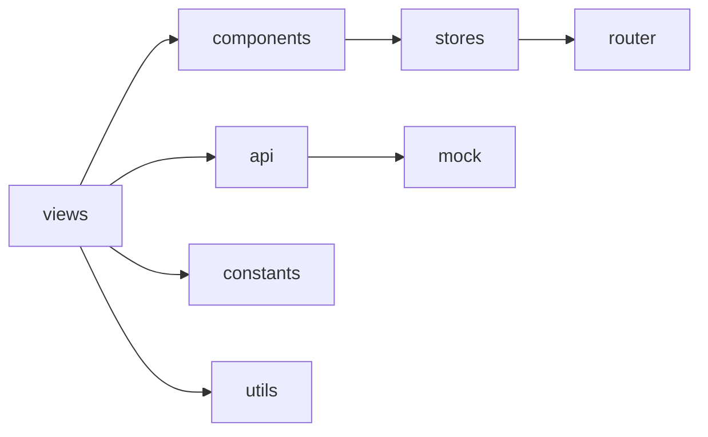
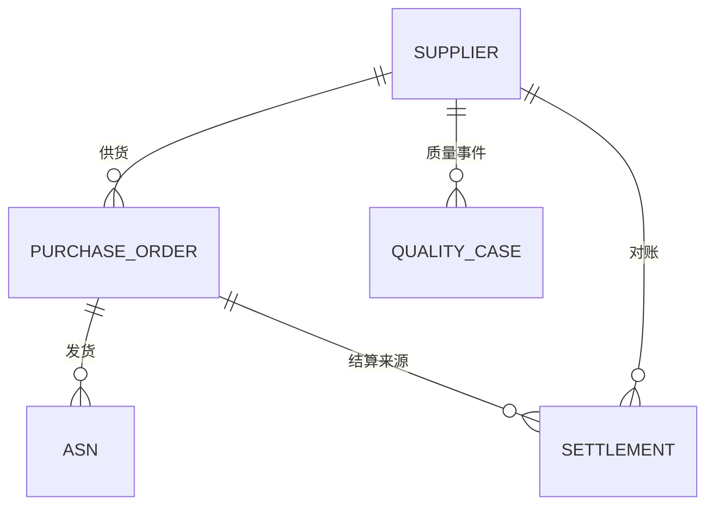

## 1. 架构设计



## 2. 技术说明
- 前端：Vue 3 + TypeScript + Vite。
- UI 组件：Element Plus + Element Plus Icons。
- 状态管理：Pinia，管理用户、权限、字典与布局状态。
- 路由：Vue Router 4，使用 meta 控制标题、权限、菜单、门户类型。
- HTTP：Axios 封装统一请求，当前业务页面优先接入虚拟 API，后续可替换为真实后端接口。
- 工具：Day.js 用于日期格式化，Lodash-es 预留复杂数据处理能力。
- 数据：第一、二阶段使用前端 Mock 数据，不依赖数据库与后端服务。

## 3. 路由定义
| 路由 | 用途 |
|---|---|
| /login | 登录页 |
| /purchasing/dashboard | 采购方工作台 |
| /purchasing/suppliers | 供应商列表 |
| /purchasing/suppliers/:id | 供应商详情 |
| /purchasing/orders | 采购订单列表 |
| /purchasing/orders/:id | 采购订单详情 |
| /purchasing/asn | ASN 列表 |
| /purchasing/asn/create | 创建 ASN |
| /purchasing/asn/:id | ASN 详情 |
| /purchasing/quality | 质量协同列表 |
| /purchasing/quality/:id | 质量详情 |
| /purchasing/settlements | 对账列表 |
| /purchasing/settlements/:id | 对账详情 |
| /403 | 无权限页面 |
| /404 | 页面不存在 |

## 4. API 定义

```typescript
interface ApiResult<T> {
  code: number
  message: string
  data: T
}

interface PageResult<T> {
  records: T[]
  total: number
  pageNum: number
  pageSize: number
}

interface LoginRequest {
  username: string
  password: string
}

interface LoginResponse {
  token: string
  user: UserInfo
  permissions: string[]
}
```

当前阶段实现 `mockApi` 与模块化数据文件，保持接口函数形态接近真实后端：`login`、`getCurrentUser`、`getSupplierPage`、`getOrderPage`、`getAsnPage`、`getQualityPage`、`getSettlementPage`、`getDetailById`。

## 5. 前端模块图



## 6. 数据模型

### 6.1 数据模型定义



### 6.2 前端类型模型
- `Supplier`：供应商编码、名称、等级、状态、联系人、准入阶段、绩效分。
- `PurchaseOrder`：订单号、供应商、金额、交期、状态、确认状态、风险等级。
- `AsnNotice`：ASN 号、订单号、供应商、发货时间、预计到货、收货状态。
- `QualityCase`：质量单号、类型、供应商、严重等级、处理状态、责任人。
- `Settlement`：对账单号、供应商、周期、金额、差异金额、发票状态、付款状态。
